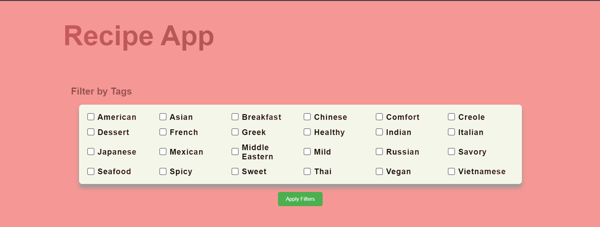
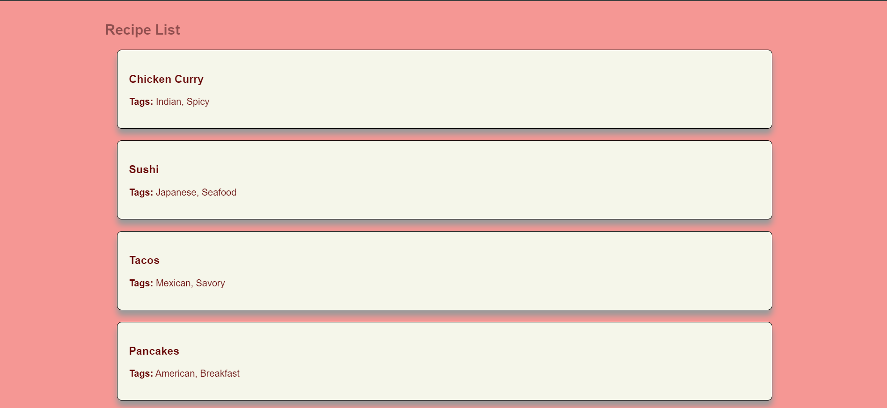
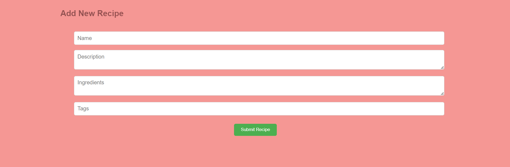

# Recipe App

This repository contains the source code for the Recipe App, a full-stack application built using React for the frontend and Django for the backend. The application allows users to browse recipes, filter them by tags, and submit new recipes for review.

## Frontend

### Features

- **Recipe Listing**: Displays a list of recipes with names, descriptions, ingredients, and tags.
- **Filtering**: Allows users to filter recipes by tags.
- **Recipe Submission**: Users can submit new recipes, which are added to a pending list for review.
- **Responsive Design**: The UI is designed to be responsive and user-friendly.

### Technologies Used

- **React**: A JavaScript library for building user interfaces.
- **Axios**: A promise-based HTTP client for making API requests.
- **CSS**: Custom styles for components.

## Backend

### Features

- **API for Recipes**: Provides endpoints to list recipes and submit new ones.
- **Database Models**: Uses Django ORM to manage recipe data.
- **Initial Data Population**: Automatically populates the database with a set of initial recipes.

### Technologies Used

- **Django**: A high-level Python web framework that encourages rapid development and clean, pragmatic design.
- **Django REST Framework**: A powerful and flexible toolkit for building Web APIs.
- **SQLite**: A lightweight, file-based database used for development.
- **Python**: The programming language used to write Django.

## Prerequisites

- Node.js, npm, and python should be installed on your system.

## Setup and Installation

1. Clone the repository:

```
git clone https://github.com/DominicVCUENG/Recipe-App.git
```

2. Navigate to the backend directory:

```
cd Recipe-App/backend/DjangoBackend
```

3. Create and activate a virtual environment:

```
python -m venv env
env\Scripts\activate
```

4. Install dependencies:

```
pip install -r requirements.txt
```

5. Run migrations:

```
python manage.py makemigrations
python manage.py migrate
```

6. Create a superuser (for admin access):

```
python manage.py createsuperuser
```

7. Start the Django development server:

```
python manage.py runserver

```

8. Navigate to the frontend directory:

```
cd Recipe-App/frontend/react-frontend
```

9. Install dependencies:

```
npm install
```

10. Start the development server:

```
npm start
```

## Usage

- Access the backend at `http://127.0.0.1:8000/`

- Access the frontend at `http://127.0.0.1:3000/`

## Screenshots






